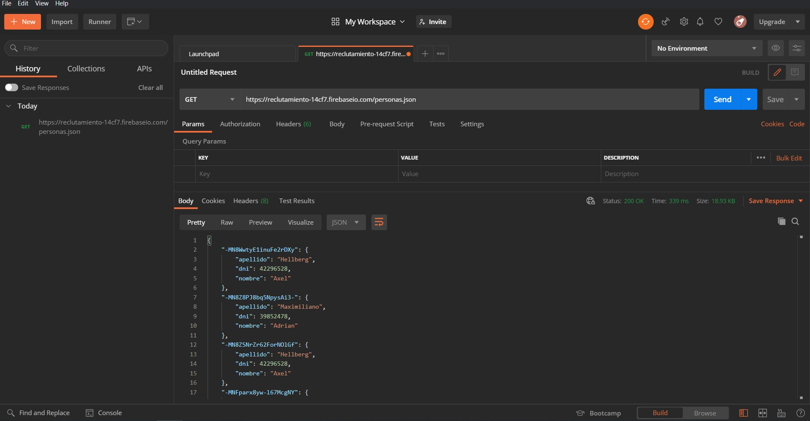

# Practicas

## EJERCICIO 2
Las siguientes preguntas están orientadas a la comprensión del protocolo HTTP. Son agnósticas al lenguaje de programación, la idea es comprender los conceptos del estándar:
### **1.	¿Qué es un servidor HTTP?**
Un servidor web (o HTTP), es una aplicación en una computadora (en este caso un servidor pero podría ser una laptop funcionando como servidor o incluso un refri inteligente) procesa requests a través del protocolo HTTP, el cual es un protocolo para intercambiar información en internet. En este servidor se almacena información la cual es accesible a través de una conexión TCP y un navegador. 
<br><br>

### **2 ¿Qué son los verbos HTTP? Mencionar los más conocidos** <br>
**GET**. Lectura de datos, pide al servidor información, representada en un XML o JSON. La información es mostrada en la URI (URL+URN). Sin importar cuántas veces se ejecute el método, siempre regresará el mismo resultado (idempotencia). 
El código de éxito es 200, el de fracaso es el 400 o 404 (no se encontró lo que se buscó en el GET), 
<br><br>
**POST**. Crea un recurso en el servidor. Su contenido no se muestra en la URL. Ejecutar este verbo/método hará que se cree múltiples veces el recurso en el servidor. Tiene el código de status 201 para un POST exitoso.
<br><br>
**PUT**. Crea un recurso nuevo y actualiza un recurso ya existente, en caso de no existir, se crea. Regresa el código 200 como GET si al actualizar regresa algo. Si no, regresa el 204 para confirmar. En caso de que no se haya actualizado nada, si no que se creó un recurso (POST), regresa el código 201. 
<br><br>
**PATCH**. Parecido a PUT, actualiza un recurso, con la diferencia que en PUT reemplaza un recurso completo con uno nuevo, mientras que PATCH solo modifica al existente. La respuesta puede ser un código 200 o 204. 
<br><br>
**DELETE**. Elimina un recurso especificado en la URI.
<br><br>
**HEAD**. Regresa la información HTTP del método GET pero sin el cuerpo del mensaje, solo los encabezados. 

###  **3.	¿Qué es un request y un response en una comunicación HTTP? ¿Qué son los headers?**
En HTTP se habla a través de peticiones y respuestas (request y response). Un request es una petición hecha por el cliente (un navegador web) y un response es la respuesta del servidor a esta petición, que puede ser una página web, una alerta, un dato, etc. 
<br>
Los headers son la información adicional en los request o responses. La primera línea del mensaje indica la versión del protocolo (HTTP/1 ó 2), el código de status y un mensaje que describa al código. El resto de la información son los headers, que contienen información como la fecha, el tipo de servidor, la última fecha de modificación, el tamaño del archivo etc. Hay diferentes tipos de headers, generales, de request, de response y de entidad. 	


### **4.	¿Qué es un queryString? (En el contexto de una url)**
Es una consulta hecha a través del url del sitio, se suele poner después del símbolo “?”, se puede leer como un WHERE de bases de datos. Por ejemplo, en el link https://www.youtube.com/#### tenemos un video de youtube, pero si le ponemos un ?t=24 al final, le estamos dando un parámetro para ese link. Aunque nos lleve al mismo video, ahora nos llevará al tiempo 24 de ese video. En estas queries podemos usar varios operadores como && (And), <, >, !=. 

### **5.	¿Qué es el responseCode? ¿Qué significado tiene los posibles valores devueltos?**
Los responseCode o Status Code, son indicadores numéricos que describen el resultado (respuesta) por parte de HTTP. 
* Respuesta informativa (100-199)
* Respuesta exitosa (200-299)
* Redirecciones (300-399)
* Errores del cliente (400-499)
* Errores del servidor (500-599)

### **6.	¿Cómo se envía data en un Get y cómo en un POST?**
**GET** lleva los datos de forma visible para el usuario a través del URL (URI en realidad).  La información viaja en el header del HTTP request, con su respectivo identificador después de un “?”. <br>
Por su parte, **POST** consiste en datos que están en el body del HTTP request, por lo que no son visibles en la URI, estos datos son enviados a través de un formulario que a través de una acción ejecuta el método POST en el servidor, 

### **7.	¿Qué verbo http utiliza el navegador cuando accedemos a una página?**
**GET**, ya que estamos recuperando un recurso del servidor, en este caso la página web. 

### **8.	Explicar brevemente qué son las estructuras de datos JSON y XML dando ejemplo de estructuras posibles.**
JSON. JavaScript Object Notation. Es un formato de texto de tipo key:value que almacena datos estructurados, frecuentemente utilizado en bases de datos. Puede tener dos estructuras:
* Una colección de pares de atributo: valor. Esto se conoce como objeto, estructura, tabla hash, array asociativo, entre otros. 
  * Un objeto comienza con { y termina con }. Cada atributo es seguido por : y los pares atributo:valor están separados por comas.
  ```
  “alumno”: {“nombre”: “Santiago”, “carrera”: “Ingeniería de software”, “campus”: ”Ciudad de México”}}
  ```
* Una lista ordenada de valores.  Se suele implementar como arrays, vectores, listas o secuencias de acuerdo al lenguaje.
  * Un array tiene sintaxis de empezar con [ y terminar con ], con valores separados por comas (a excepción del último elemento de la lista). Cada elemento del array representa a su vez un objeto, por lo que se debe seguir la nomenclatura de las llaves {}. <br><br>
```
{"alumno": [
        {"nombre":"Santiago", "carrera”: “Ingeniería de software"},
        {"nombre":"David", "carrera":"Arquectura"}
    ]}
```
Los atributos de un valor también pueden contener números enteros, decimales, valores booleanos, nulos, un objeto u otra lista. 
<br><br>
**XML**. Extensible Markup Language. Es un meta lenguaje y estándar que estructura el intercambio de información y define una serie de reglas para codificar documentos. Tiene dos partes:
* Prólogo. Es opcional. Contiene una secuencia de instrucciones de procesamiento o declaración del tipo de documento. A su vez se subdivide en dos partes:
  * Declaración XML. Indica la versión de xml, el tipo de codificación y la autonomía del documento.
  *   Declaración de tipo de documento. Indica qué tipo de documento es.
* Cuerpo. Es el contenido de información del documento, organizado de etiquetas anidadas de forma parecida a HTML.

### **9.	Explicar brevemente el estándar SOAP**
**SOAP** es un estándar basado en **XML** para la transmisión de mensajes en HTTP y otros protocolos de Internet. Es un protocolo ligero para el intercambio de información en un entorno descentralizado y distribuido. Se basa en XML y consta de tres partes:

* Una convención para representar llamadas y respuestas a procedimiento remoto.
* Un sobre que define una infraestructura para describir el contenido del mensaje y cómo procesarlo.
* Un conjunto de normas de codificación para expresar instancias de tipos de datos definidos por la aplicación.

SOAP permite el enlace y la utilización de servicios Web encontrados definiendo una ruta de mensaje para el direccionamiento de mensajes. Se puede utilizar SOAP para consultar UDDI para servicios Web.

### **10.	Explicar brevemente el estándar REST Full**
Representational State Transfer. Es una arquitectura para aplicaciones basadas en redes. Los servicios Web REST full se basan en recursos. Estos recursos son cualquier tipo de archivo guardado en usualmente un servidor y el cliente solicita el recurso utilizando servicios Web también REST full. 
* Cada operación requiere del método URI y HTTP
* Tiene cinco operaciones básicas: listar, crear, leer, actualizar y borrar.
* El URI es un sustantivo que contiene el nombre del recurso. URL+URN= URI

### **11.	¿Qué son los headers en un request? ¿Para qué se utiliza el key Content-type en un header?**

Son los parámetros que se envían en un request o response HTTP al cliente o al servidor para dar información esencial sobre la transacción. Los headers tienen formato ‘key: value’ y son enviadas automáticamente por el navegador o servidor web.<br>
Content-Type es una propiedad del header que indica el media type (por ejemplo audio/mp4 o image/jpeg ) del recurso. Es un header de entidad. 
<br><br/>

## Ejercicio 3

1.	Realizar un request GET a la URL: https://reclutamiento-14cf7.firebaseio.com/personas.json

 

2.	Realizar un request POST a la URL anterior, y con body:
```
{
    "nombre":"Tu nombre",
    "apellido":"Tu apellido",
    "dni":11223322
}
```


3.	Realizar nuevamente un request GET a la URL: https://reclutamiento-14cf7.firebaseio.com/personas.json ¿Qué diferencias se observan?

*En el nuevo GET la BD estaba actualizada con el contenido del último POST que se realizó.*

 


## EJERCICIO 4:
Realizar un script en Node.js con nombre de página  "mostrarPersonas.js" que haga un GET con la biblioteca request-promise a la url anterior: https://reclutamiento-14cf7.firebaseio.com/personas.json y muestre los resultados por consola.

 > [**_SOLUCIÓN:_**](./mostrarPersonas.js)  Antes de ejecutar el programa instala las dependencias usando `npm install` escribiendo el comando en la consola estado en la carpeta del proyecto. Si todas las dependencias se instalaron correctamente solo debes escribir `node mostrarPersonas.js` para ejecutar el archivo.

## EJERCICIO 5:
Crear un servidor en Node.js con la biblioteca “express” que pueda recibir un request POST con el formato json previamente mencionado:
Ej:
```
{
    "nombre":"Tu nombre",
    "apellido":"Tu apellido",
    "rfc":11223322
}
```
Se deberá validar que el json posea el formato correcto:
* El campo RFC y apellido son obligatorios
* 	El campo nombre y apellido son cadenas de texto (String)
*	El campo RFC es numérico de máximo 10 caracteres
*	Si el usuario manda un json con más atributos que los mencionados deberá notificarlo como error

Reciba la información deberá insertar en la BD realizando un post a la URL: https://reclutamiento-14cf7.firebaseio.com/personas.json 
El servicio deberá responder:
* status code: 201 y el json que devuelve el post en caso de que se haya ingresado exitosamente.
* status code 400 si el formato del json es inválido.
* status code 500 por cualquier otro error no previsto.

 > [**_SOLUCIÓN:_**](./server.js) En este archivo se comprobó el formato de un objeto json que es enviado desde el [ formulario](./crearPersonas.html) y se envía a traés del método POST a la base de datos del URL dado.
## EJERCICIO 6:
Realizar un programa en HTML con nombre de página “crearPersonas.html” que tenga 3 inputs text en html (nombre, apellido y RFC) y un botón de “enviar”. Al presionar dicho botón se deberá realizar un POST al servicio que fue levantando en el punto 5
 > [**_SOLUCIÓN:_**](./crearPersonas.html) En este archivo se realizó un formulario con 3 campos cuyo contenido será organizado en un objeto JSON para después mandarlo al [servidor](./server.js) levantado en el ejercicio anterior. 
